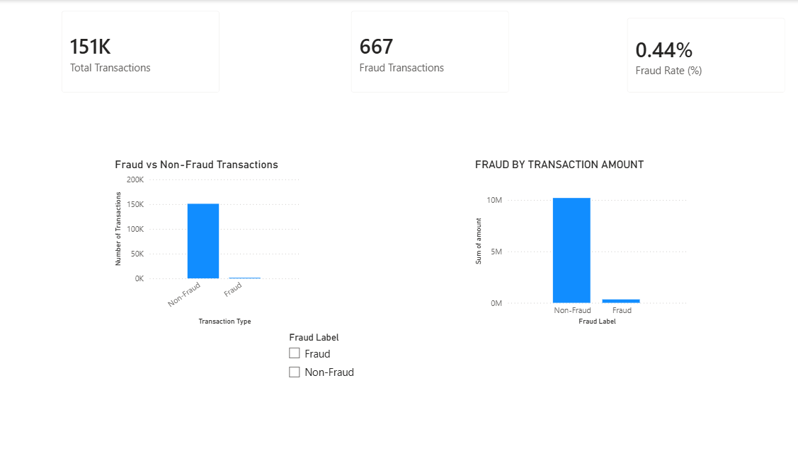
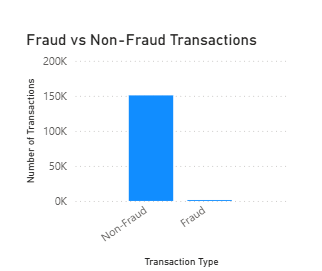

# Financial Risk and Fraud Analysis

## Overview
This project analyzes transaction-level data to identify fraud patterns using SQL, Python, and Power BI.

## Tools Used
- MySQL (Data storage & analysis)
- Python (Data ingestion)
- Power BI (Visualization)

## Key Analysis
- Fraud vs Non-Fraud distribution
- Fraud by merchant category
- High-risk transactions
- Inventory of fraud patterns

## Project Structure
- sql/ → SQL analysis queries
- python/ → Data ingestion scripts
- dashboard/ → Power BI files
- screenshots/ → Dashboard images
## 📊 Power BI Dashboard

### Dashboard Overview

### Fraud vs Non-Fraud Transactions

